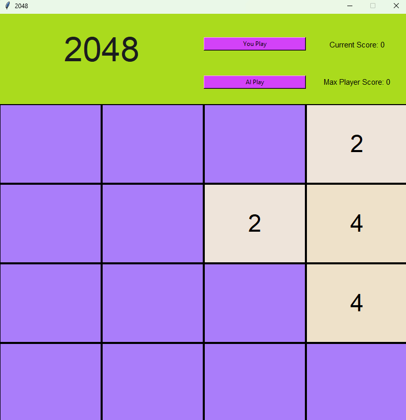
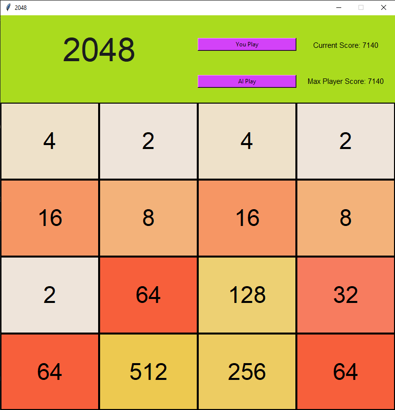
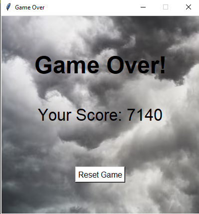

# 2048 

## The Team

#### Jakin Chan 
- [x] GitHub: https://github.com/JakinChan200

#### Nathan Kong
- [x] GitHub: https://github.com/NathanKong06

#### Shruti Jawale:
- [x] GitHub: https://github.com/shjawale

## Overview
This is a Python application based off of the popular online minigame "2048" where one tries to achieve the 2048 tile through combining smaller tiles. Our application keeps track of your highest score, and has an option for the bot to automatically play the game.

## Tech Stack

## Images
Bot Playing:

Example Game Screen:

Game Over Screen:

## Usage
### Player Play Mode
Click `You Play` and use the &uarr; &darr; &larr; &rarr; keys to merge similar tiles. Try to get the 2048 tile!

### Bot Mode
Click `AI Play` and watch as it attempts to get the 2048 tile!